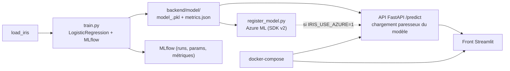

<h1 align="center">iris_dataset</h1>

<p align="center">
  Chaîne MLOps de bout en bout - entraîner, versionner, servir, tester, déployer,
  documenter - sur un cas <b>volontairement simple</b> (dataset Iris, régression
  logistique). L'objet du projet est la rigueur du pipeline, pas la difficulté de
  la donnée.
</p>

<p align="center">
  
  
  
  
   <!-- [PAS ENCORE LIVRE] : après ajout du fichier LICENSE -->
</p>

> Note : "Iris + régression logistique" est un choix assumé. Le but est de montrer
> une chaîne complète - de l'entraînement au service et au déploiement - lisible
> d'un seul coup d'oeil, sans bruit métier. Sur un jeu de données réel, seul le
> module d'entraînement changerait.

---

## Le problème

Prédire la variété d'un iris (setosa, versicolor, virginica) à partir de 4 mesures.
Le problème est trivial et sépare parfaitement : c'est **voulu**. La question à
laquelle ce dépôt répond est ailleurs : à quoi ressemble une chaîne MLOps complète,
propre et reproductible, autour d'un modèle ?

## La solution

- **Entraînement** (`backend/ml/train.py`) : `load_iris`, découpage 80/20
  (`random_state=42`), `LogisticRegression`, suivi MLflow (`autolog`). Sortie :
  un `model_<run_id>.pkl` (joblib) et un `metrics.json` (exactitude, F1 macro) dans
  `backend/model/`.
- **Registre de modèle** (`backend/scripts/register_model.py`) : enregistrement du
  modèle dans Azure ML (SDK v2), pour la partie déploiement.
- **Service** (`backend/app/api.py`) : API FastAPI. `POST /predict` renvoie la
  classe et la variété. Le modèle est chargé **paresseusement** au premier appel ;
  par défaut le dernier `.pkl` local, ou Azure ML si `IRIS_USE_AZURE=1`. L'import du
  SDK Azure est lui aussi paresseux (l'API démarre sans lui).
- **Interface** (`frontend/`) : formulaire Streamlit qui appelle l'API.
- **Conteneurisation** : `backend/Dockerfile`, `frontend/Dockerfile`,
  `docker-compose.yml` (réseau dédié, `API_URL` par variable d'environnement).
- **Tests** (`backend/tests/`) : `test_pipeline.py` (le dernier modèle se charge et
  prédit une classe valide) et `test_api.py` (routes `/` et `/predict` via
  `TestClient`).
- **Documentation** : site MkDocs (`docs/`).

## Architecture



```
iris_dataset/
|- backend/
|  |- ml/            train.py (entraînement + MLflow)
|  |- app/           api.py (FastAPI /predict)
|  |- scripts/       register_model.py, deploy_endpoint.py, score.py
|  |- model/         modèles .pkl + metrics.json
|  |- tests/         test_pipeline.py, test_api.py
|  \- Dockerfile
|- frontend/         app.py, pages/page_predict.py, Dockerfile
|- docs/             site MkDocs
|- docker-compose.yml
\- .github/workflows/ci-cd.yml
```

## Stack technique

| Domaine | Outils |
|---|---|
| Modèle | scikit-learn (`LogisticRegression`) |
| Suivi d'expériences | MLflow (`autolog`) |
| Registre / déploiement | Azure ML (SDK v2) |
| API | FastAPI, Uvicorn, Pydantic |
| UI | Streamlit |
| Tests | pytest |
| Documentation | MkDocs |
| Conteneurisation / CI | Docker, docker-compose, GitHub Actions |

## Installation et utilisation

Prérequis : **Python 3.11**.

```bash
git clone <url-du-repo> && cd iris_dataset/backend
python3.11 -m venv .venv && source .venv/bin/activate
pip install -r requirements.txt
export PYTHONPATH="$PWD"

# Entraînement (crée backend/model/model_<run>.pkl + metrics.json ; MLflow local)
python ml/train.py

# Tests
pytest -q

# API
uvicorn app.api:app --reload            # http://127.0.0.1:8000/docs

# Front (dans un autre terminal, depuis iris_dataset/frontend)
streamlit run app.py                    # http://127.0.0.1:8501
```

Ou tout en conteneurs :

```bash
docker compose up --build              # API : 8000, front : 8501
```

Exemple d'appel :

```bash
curl -X POST http://127.0.0.1:8000/predict \
  -H "Content-Type: application/json" \
  -d '{"sepal_length": 5.1, "sepal_width": 3.5, "petal_length": 1.4, "petal_width": 0.2}'
# -> {"prediction": 0, "variety": "setosa"}
```

## Résultats

Le dataset Iris est linéairement séparable ; la régression logistique atteint une
exactitude proche de 1 sur le jeu de test (30 échantillons). Les valeurs exactes du
dernier entraînement sont dans `backend/model/metrics.json`, régénéré par
`python ml/train.py`. Aucune valeur n'est recopiée à la main dans ce README.

## Limites connues

- Dataset volontairement trivial : ce dépôt ne démontre pas de modélisation
  difficile, seulement l'outillage autour.
- Le pipeline CI complet suppose des identifiants Azure ; un job de tests
  indépendant d'Azure est en cours d'ajout. [PAS ENCORE LIVRE]
- Plusieurs modèles `.pkl` sont versionnés ; une déduplication est prévue.
  [PAS ENCORE LIVRE]

## Améliorations futures

- Job CI de tests indépendant + badge.
- Fiche modèle (`MODEL_CARD.md`).
- Comparaison de deux modèles (régression logistique / forêt aléatoire) tracés dans
  MLflow.
- Remplacer Iris par un jeu de données réel pour une seconde version.

## Ce que ce projet démontre

Chaîne MLOps complète et lisible : entraînement suivi par MLflow, sérialisation et
versionnage du modèle, service par API FastAPI (chargement paresseux, dépendance
cloud optionnelle), tests, conteneurisation (Docker, docker-compose),
documentation (MkDocs), intégration continue GitHub Actions.

## Auteur

**Nabil Ghazali** - [LinkedIn](https://www.linkedin.com/in/nabil-ghazali-dev/) -
[GitHub](https://github.com/nabil-ghazali)

## Licence

MIT (fichier `LICENSE` à ajouter). [PAS ENCORE LIVRE]
